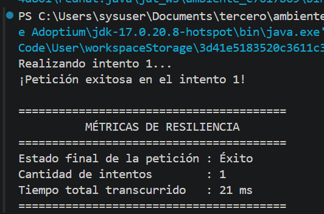
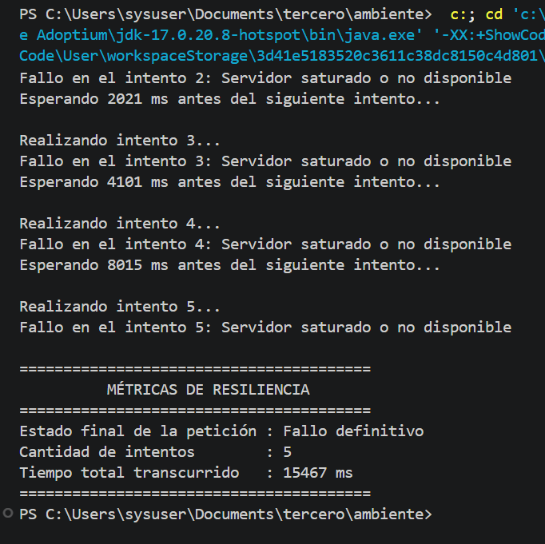

Efecto Estampida ("Thundering Herd Problem")
Cuando un servidor sufre una caída o saturación y múltiples clientes están programados para reintentar exactamente al mismo tiempo con intervalos fijos (sin Jitter), todos generan tráfico simultáneamente en oleadas sincronizadas. Esto provoca picos abruptos de carga que saturan nuevamente el recurso, impidiendo su recuperación y generando un ciclo continuo de caídas. El uso de Jitter (añadir un factor de aleatoriedad) desincroniza las peticiones de los clientes, distribuyendo el tráfico de manera uniforme en el tiempo.

Diferencia entre Fallo Transitorio y Fallo Permanente

Fallo Transitorio: Un error temporal causado por condiciones momentáneas que se resuelve por sí mismo al cabo de un breve instante.

Ejemplo en arquitectura distribuida: Un timeout de conexión a una base de datos porque el pool de conexiones está temporalmente saturado, o una interrupción momentánea en la red entre dos microservicios.

Fallo Permanente: Un error estructural o lógico que no se solucionará por más que la petición se repita, requiriendo intervención o corrección de código/datos.

Ejemplo en arquitectura distribuida: Un error HTTP 404 (Recurso no encontrado) debido a una URL mal escrita, o un fallo de autenticación por credenciales inválidas.

## Ejemplo de ejecución

Las siguientes capturas muestran una ejecución del cliente resiliente:

### Resultado 1

### Resultado 2

