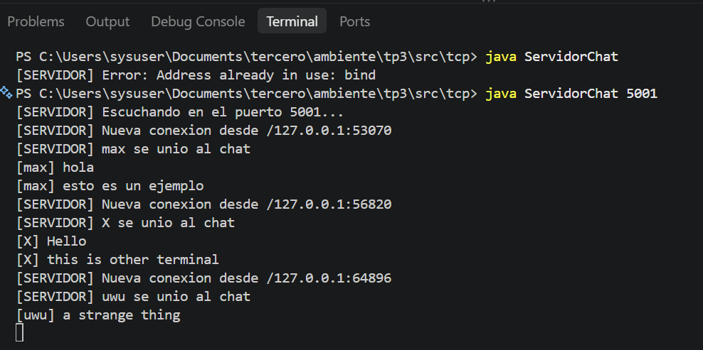
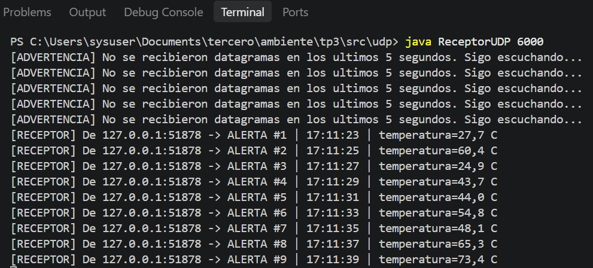

# TP3 – Sockets TCP/UDP con API java.net y Servidores Multihilo

**Materia:** Desarrollo de Aplicaciones para Ambientes Distribuidos
**Unidad 2:** Comunicación entre Procesos y Concurrencia
**Docente:** Lic. Gabriel Artaza

---

## Estructura del proyecto

```
tp3/
├── README.md
├── capturas/              # capturas de la ejecución
└── src/
    ├── tcp/
    │   ├── ServidorChat.java   # servidor multihilo con broadcast (puerto 5000)
    │   └── ClienteChat.java    # cliente de chat
    └── udp/
        ├── EmisorUDP.java      # envía alertas cada 2 s (puerto 6000)
        └── ReceptorUDP.java    # recibe con setSoTimeout(5000)
```

---

## Ejercicio 1: Chat multihilo (TCP)

- El **servidor** abre un `ServerSocket` en el puerto 5000 y en un bucle llama a `accept()`. Por cada cliente que se conecta crea un `ManejadorCliente` (`Runnable`) y lo lanza en un `Thread` nuevo, así el hilo principal queda libre para seguir aceptando conexiones.
- Los clientes conectados se guardan en un `Set` thread-safe (`ConcurrentHashMap.newKeySet()`), porque varios hilos lo leen y modifican al mismo tiempo.
- **Broadcast:** cuando un cliente manda un mensaje, el servidor lo reenvía a todos los demás clientes de la lista.
- **Desconexiones:** si `readLine()` devuelve `null` (el cliente cerró), si escribe `/salir` o si salta una `IOException` (cierre abrupto), en el `finally` se saca al cliente de la lista, se avisa al resto y se cierra **solo su socket**. El servidor sigue funcionando.
- El **cliente** usa dos hilos: uno lee el teclado y envía, y otro escucha lo que llega del servidor. Así se pueden recibir mensajes mientras se escribe.

## Ejercicio 2: Alertas y telemetría (UDP)

- **Emisor:** crea un `DatagramSocket`, arma cada alerta como `byte[]`, la mete en un `DatagramPacket` junto con la IP y el puerto de destino y la manda con `send()` cada 2 segundos. No espera confirmación.
- **Receptor:** hace `bind` al puerto 6000 y configura `socket.setSoTimeout(5000)`. Si pasan 5 segundos sin datagramas, `receive()` lanza `SocketTimeoutException`, que se captura: se imprime una advertencia y el bucle sigue escuchando.

---

## Cómo compilar y ejecutar

Requisito: JDK 11 o superior (`java -version`).

### TCP (chat)

```bash
cd tp3/src/tcp
javac *.java

# Terminal 1: servidor
java ServidorChat            # o: java ServidorChat 5000

# Terminales 2, 3 y 4: un cliente en cada una
java ClienteChat             # o: java ClienteChat <ip-servidor> 5000
```

Cada cliente ingresa su nombre y después escribe mensajes. Con `/salir` se desconecta.

### UDP (alertas)

```bash
cd tp3/src/udp
javac *.java

# Terminal 1: receptor
java ReceptorUDP             # o: java ReceptorUDP 6000

# Terminal 2: emisor
java EmisorUDP               # o: java EmisorUDP <ip-receptor> 6000 2000
```

Para probar el timeout se corta el emisor con `Ctrl+C`: a los 5 segundos el receptor muestra la advertencia y sigue esperando.

---

## Capturas

### Servidor TCP con 3 clientes conectados



### Receptor UDP con timeout




---

## Cuestionario

### 1. Capa de transporte: TCP vs UDP

En un sistema distribuido los nodos no comparten memoria, así que se comunican solo por paso de mensajes, y TCP y UDP son las dos formas de hacerlo en la capa de transporte.

| | **TCP** (orientado a conexión) | **UDP** (sin conexión) |
|---|---|---|
| Conexión | Necesita establecerla antes con el *three-way handshake* (SYN → SYN-ACK → ACK) y cerrarla al final | No hay negociación previa, se envía directamente ("disparar y olvidar") |
| Datos | Flujo continuo de bytes, **no respeta límites de mensaje** (la aplicación tiene que delimitarlos, por ejemplo con saltos de línea) | Cada datagrama es independiente y **se respetan sus límites** |
| Fiabilidad | Entrega garantizada, en orden y sin duplicados (números de secuencia, ACKs y retransmisión) | Sin garantía de entrega, orden ni duplicados (modelo de fallo por omisión) |
| Control | Control de flujo y de congestión | No tiene, si el receptor no da abasto descarta paquetes |
| Costo | Más sobrecarga y latencia | Poca sobrecarga, baja latencia |
| En Java | `ServerSocket` / `Socket` + streams | `DatagramSocket` / `DatagramPacket` |
| Usos | Chat, transferencia de archivos, HTTP, transacciones | Streaming, VoIP, juegos, DNS, telemetría |

En resumen: TCP se usa cuando cada byte importa (por eso el chat va por TCP) y UDP cuando importa más la velocidad que la exactitud (por eso las alertas periódicas van por UDP: si se pierde una, llega otra a los pocos segundos).

### 2. API `java.net`: `ServerSocket.accept()` y un hilo por cliente

`accept()` **bloquea** el hilo hasta que un cliente se conecta. Cuando llega una conexión (ya completado el handshake), devuelve un **`Socket` nuevo y exclusivo** para comunicarse con ese cliente, mientras el `ServerSocket` sigue escuchando en el puerto para recibir otras conexiones.

Hace falta un hilo por cliente porque las operaciones de E/S de los sockets TCP son **bloqueantes**: `readLine()` se queda esperando hasta que el cliente mande algo. Si el servidor atendiera todo en un solo hilo, mientras espera a un cliente no podría volver a `accept()` ni leer a los otros, o sea que atendería de a un cliente por vez. Con el patrón *hilo aceptador + manejadores*:

- el hilo principal solo hace `accept()` y delega,
- cada hilo manejador mantiene el estado de su conexión y se bloquea sin afectar a los demás,
- un error o desconexión de un cliente queda aislado en su hilo y no tira abajo el servidor.

Una mejora para muchos clientes sería usar un *pool* de hilos (`ExecutorService`) para no crear hilos sin límite.

### 3. Manejo de errores y resiliencia: pérdida de paquetes UDP

Si un datagrama se pierde en la red, **nadie se entera**: UDP no tiene ACKs ni retransmisión, así que el emisor no recibe ningún error y el receptor simplemente no recibe nada. El mensaje se pierde y, si hace falta recuperarlo, lo tiene que resolver la aplicación (números de secuencia, confirmaciones propias, reenvío, etc.).

El receptor no puede detectar la pérdida de **un paquete puntual**, pero con `setSoTimeout()` sí puede detectar la **ausencia de datos**. Normalmente `receive()` bloquea para siempre; con `setSoTimeout(5000)` bloquea como máximo 5 segundos y, si no llega nada, lanza `SocketTimeoutException`. El socket sigue siendo válido, así que se captura la excepción, se registra la advertencia y se vuelve a llamar a `receive()`. Esto evita que el receptor quede colgado y le permite darse cuenta de que el emisor dejó de enviar o de que hay problemas en la red. En el programa, además, el contador `ALERTA #n` permite ver si falta algún número en la secuencia.

