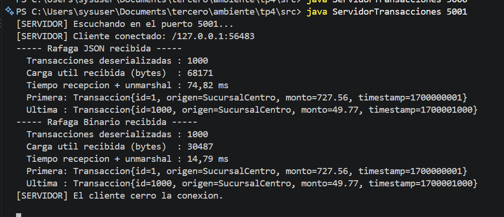
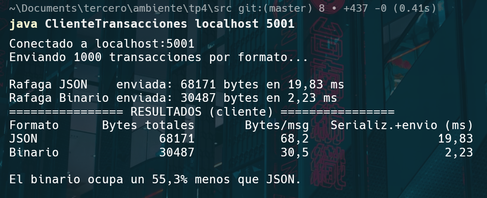

# TP4 – Representación de Datos y Paso de Mensajes

**Materia:** Desarrollo de Aplicaciones para Ambientes Distribuidos
**Docente:** Lic. Gabriel Artaza

**Objetivo:** serializar (marshalling) un objeto `Transaccion` en dos formatos, JSON y binario, enviarlo por un socket TCP, deserializarlo (unmarshalling) en el servidor y comparar el tamaño y el tiempo de cada formato.

---

## Estructura del proyecto

```
tp4/
├── README.md
├── capturas/
└── src/
    ├── Transaccion.java             # estructura de datos
    ├── ParserMensajes.java          # JSON <-> objeto y binario <-> objeto
    ├── Protocolo.java               # constantes compartidas (puerto, tipos de mensaje)
    ├── ServidorTransacciones.java   # recibe y hace el unmarshalling
    └── ClienteTransacciones.java    # envía 1000 transacciones en JSON y en binario
```

---

## Resolución

### 1. Estructura de datos

`Transaccion` tiene los cuatro campos pedidos:

| Campo | Tipo Java | Tamaño en memoria |
|---|---|---|
| `idTransaccion` | `int` | 32 bits |
| `origen` | `String` | variable |
| `monto` | `double` | 64 bits (IEEE 754) |
| `timestamp` | `long` | 64 bits |

### 2. Formatos de intercambio (`ParserMensajes`)

La red no entiende objetos, solo secuencias de bytes. Por eso hay que **aplanar** el objeto (marshalling) antes de enviarlo y **reconstruirlo** del otro lado (unmarshalling). Además, emisor y receptor tienen que acordar antes cómo se interpreta cada byte.

**JSON (texto):** cada campo se escribe como texto con su nombre:

```json
{"id":101,"origen":"NodoA","monto":1500.5,"timestamp":1700000000}
```

- Es legible y fácil de depurar, y lo entiende cualquier lenguaje.
- Ocupa más, porque se repiten los nombres de los campos y los números viajan como caracteres (el long `1700000000` ocupa 10 bytes en lugar de 8).
- Hay que *parsear* el texto para volver a obtener los números, y eso cuesta CPU.
- Uso `Locale.US` para que el decimal salga con punto: con la configuración en español saldría `1500,5` y el JSON quedaría mal formado.

**Binario directo (`DataOutputStream`):** los campos se escriben como bytes, uno detrás del otro, sin nombres:

```
[ int: 4 bytes ][ largo: 2 bytes | origen: n bytes ][ double: 8 bytes ][ long: 8 bytes ]
```

- Es mucho más compacto y no hay que convertir texto a número.
- No es legible, y el receptor tiene que leer los campos **en el mismo orden y con los mismos tipos** en que se escribieron (`readInt`, `readUTF`, `readDouble`, `readLong`). Si no, los datos llegan "correctos pero ininteligibles".
- `DataOutputStream` siempre escribe en **big-endian** (orden de red). Así se resuelve el problema de *endianness*: aunque el cliente sea un Intel (little-endian), los bytes viajan en un orden fijo que el receptor conoce.

### 3. Transmisión por TCP

Como TCP es un **flujo de bytes sin límites de mensaje** (lo vimos en el TP3), el servidor no puede saber dónde termina una transacción y empieza la otra. Para resolverlo, cada mensaje se manda con un encabezado (*framing*):

```
[ tipo: 1 byte ][ largo del payload: 4 bytes ][ payload ]
```

- `tipo` = 1 para JSON, 2 para binario, 0 para FIN (fin de la ráfaga).
- El servidor lee el tipo y el largo, después lee exactamente ese largo de bytes con `readFully()` y deserializa según el tipo.

El **cliente** genera 1000 transacciones con una semilla fija (siempre son las mismas), manda la ráfaga JSON, después la binaria, y mide el tamaño y el tiempo de cada una. Antes de medir serializa todo una vez sin enviarlo (*calentamiento*). Esto es porque la JVM compila el código a medida que lo usa (JIT), y sin ese paso el formato que se mide primero saldría perjudicado.

El **servidor** deserializa cada mensaje y, al recibir el FIN, muestra cuántas transacciones reconstruyó, los bytes recibidos, el tiempo y la primera y la última transacción, para verificar que llegaron bien.

---

## Cómo compilar y ejecutar

Requisito: JDK 11 o superior.

```bash
cd tp4/src
javac *.java

# Terminal 1
java ServidorTransacciones              # o: java ServidorTransacciones 5000

# Terminal 2
java ClienteTransacciones               # o: java ClienteTransacciones localhost 5000
```

> Ojo con el orden de los argumentos del cliente: primero el host y después el puerto.

---

## Resultados

Medición de una ejecución en `localhost` con 1000 transacciones por formato:

| Formato | Carga útil total | Bytes por mensaje | Serialización + envío (cliente) | Recepción + unmarshalling (servidor) |
|---|---|---|---|---|
| JSON | 68.171 bytes | 68,2 | 18,24 ms | 61,72 ms |
| Binario | 30.487 bytes | 30,5 | 3,08 ms | 13,95 ms |
| **Diferencia** | **55,3 % menos** | | **~6 veces más rápido** | **~4 veces más rápido** |

> Los tiempos cambian en cada ejecución y según la PC, pero la relación entre los formatos se mantiene. Los tamaños son siempre los mismos porque las transacciones se generan con semilla fija. Los 5 bytes de encabezado de cada mensaje no se cuentan como carga útil.

### Análisis

- **Tamaño:** el binario ocupa menos de la mitad. En JSON cada mensaje lleva los nombres de los campos, las comillas, las llaves y los números escritos como texto. En binario solo viajan los datos: 22 bytes fijos (4 + 2 + 8 + 8) más el texto de `origen`.
- **Tiempo:** el binario es bastante más rápido, tanto al serializar como al deserializar. Escribir un `double` son 8 bytes directos, mientras que en JSON hay que convertirlo a texto en el cliente y volver a parsearlo en el servidor. En el servidor la diferencia también incluye que, al ser el primer formato que procesa, el código de JSON todavía no está optimizado por la JVM.
- **Conclusión:** no hay un formato ganador en todo. JSON conviene cuando importa la **interoperabilidad y la depuración** (APIs web, sistemas en distintos lenguajes). El binario conviene cuando importan el **volumen y la latencia** y controlamos las dos puntas, porque ambas tienen que conocer el formato exacto. Para tener lo mejor de ambos están formatos binarios con esquema como **Protocol Buffers**, que son compactos y además funcionan entre distintos lenguajes.

---

## Capturas

### Servidor



### Cliente



---

## Fuentes

- Material de cátedra: *Serialización y Empaquetado – Teoría* (Unidad IV) y *Programación con Sockets TCP y UDP* (Clase 3), Lic. Gabriel Artaza.
- Oracle – Java SE 11 API: [`DataOutputStream`](https://docs.oracle.com/en/java/javase/11/docs/api/java.base/java/io/DataOutputStream.html), [`DataInputStream`](https://docs.oracle.com/en/java/javase/11/docs/api/java.base/java/io/DataInputStream.html).
- IETF: [RFC 8259 – The JSON Data Interchange Format](https://www.rfc-editor.org/rfc/rfc8259).
