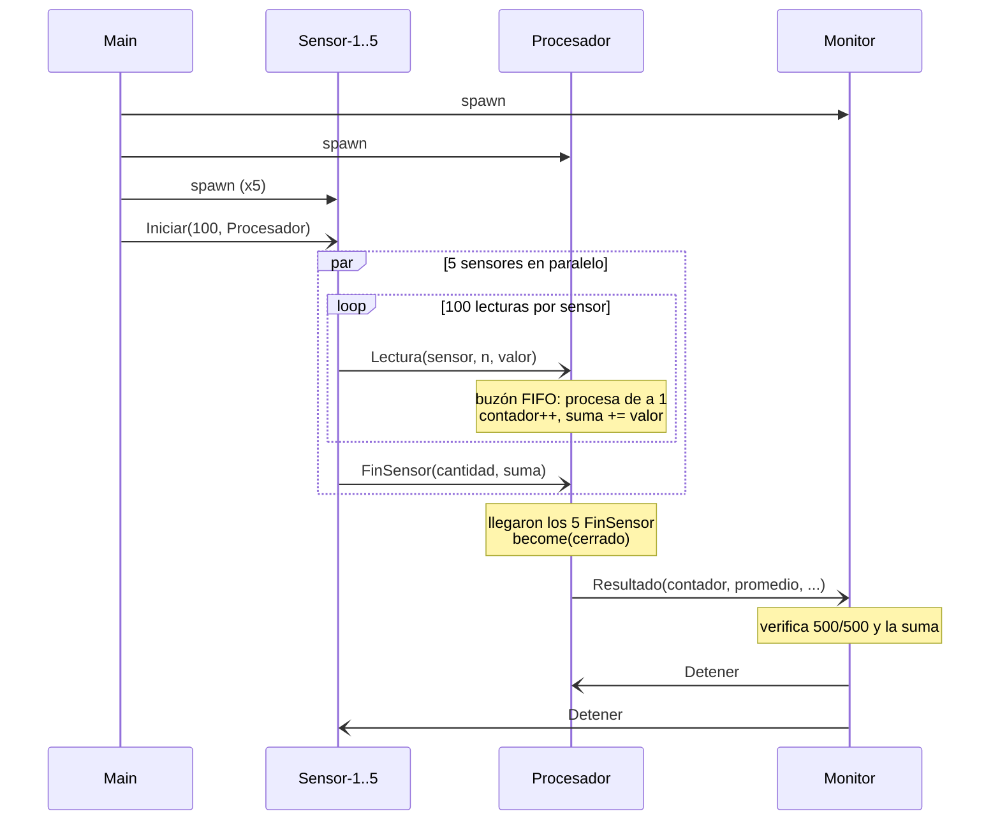
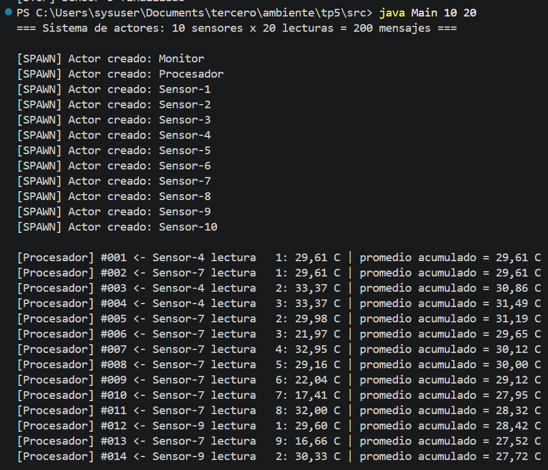
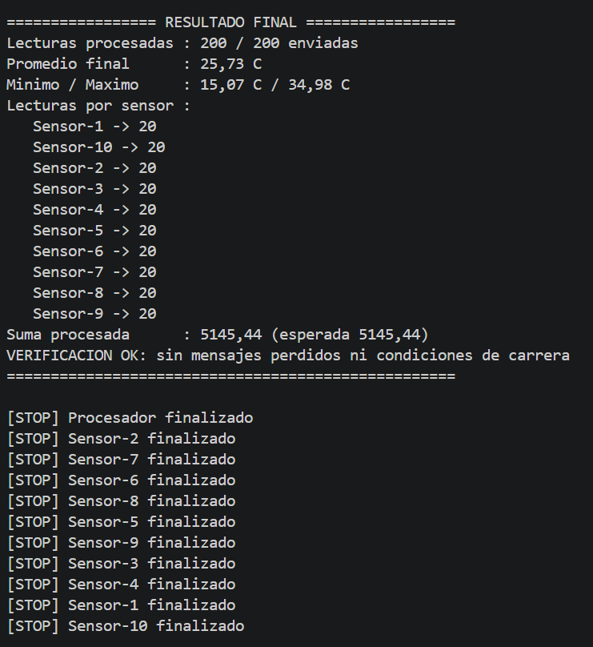

# TP5 – Concurrencia y Sincronización con el Modelo de Actores

**Materia:** Desarrollo de Aplicaciones para Ambientes Distribuidos
**Docente:** Lic. Gabriel Artaza
**Modalidad:** Individual

**Objetivo:** resolver un problema de concurrencia (muchos sensores enviando lecturas a un mismo nodo) usando solo **paso de mensajes asincrónicos**, sin memoria compartida y sin `synchronized` ni locks.

> *"No compartas memoria para comunicarte; comunícate para compartir información."*

---

## Estructura del proyecto

```
tp5/
├── README.md
├── capturas/
└── src/
    ├── Actor.java             # clase base: buzón FIFO + hilo propio + enviar()
    ├── Mensajes.java          # mensajes inmutables (Lectura, FinSensor, Resultado, ...)
    ├── ActorSensor.java       # genera y envía lecturas de temperatura
    ├── ActorProcesador.java   # procesa las lecturas y guarda contador/promedio privado
    ├── ActorMonitor.java      # muestra el resultado, lo verifica y apaga el sistema
    └── Main.java              # crea los actores y arranca los sensores
```

---

## Modelo de actores

Un **actor** es la unidad básica de cómputo. Tiene:

- **Estado privado** que nadie más puede leer ni modificar.
- **Un buzón (mailbox)** FIFO donde los demás le dejan mensajes.
- **Un comportamiento**, que define qué hace con cada mensaje.

Los actores no comparten memoria: la única forma de comunicarse es enviando mensajes. Cada actor procesa **un mensaje a la vez**, así que su estado nunca es tocado por dos hilos al mismo tiempo. Por eso no hay condiciones de carrera y no hacen falta locks.

Ante un mensaje, un actor solo puede hacer **tres operaciones**:

| Operación | Qué es | Dónde está en el código |
|---|---|---|
| **Crear (spawn)** | Crear nuevos actores con su propio buzón | `Actor.spawn(...)` en `Main`: se crean el monitor, el procesador y 5 sensores, cada uno con su hilo y su buzón |
| **Enviar (send)** | Mandar un mensaje asincrónico a otro actor | `actor.enviar(msg)`: deja el mensaje en el buzón y retorna enseguida. Los 5 sensores envían 100 lecturas cada uno **al mismo tiempo** → 500 mensajes concurrentes |
| **Designar (become)** | Definir cómo se va a atender el próximo mensaje | El procesador actualiza su estado (contador, suma, promedio, mín, máx) con cada lectura. Cuando terminan todos los sensores, hace `become(cerrado)` y pasa de *procesando* a *cerrado*: a partir de ahí descarta las lecturas nuevas |

---

## Cómo se cumplen las restricciones

- **No hay `synchronized`, `ReentrantLock` ni variables compartidas.** Todos los atributos de los actores son `private` y solo los usa el hilo del propio actor. No hay variables `static` con estado.
- **Comunicación 100 % asincrónica.** `enviar()` usa `offer()`, que no bloquea: el sensor deja el mensaje y sigue generando lecturas sin esperar respuesta.
- **Mensajes inmutables.** Las clases de `Mensajes.java` son `final` y tienen atributos `final`, así que una vez creadas nadie las puede cambiar. Las colecciones dentro de los mensajes se envían como copias de solo lectura.
- **Estado del procesador encapsulado.** `ActorProcesador` no tiene getters ni setters. El resultado sale únicamente como un mensaje `Resultado` con una **copia** de los datos.
- **Buzón:** uso `LinkedBlockingQueue`, una cola FIFO del JDK preparada para que varios hilos dejen mensajes y uno solo los saque. Es el único punto donde se cruzan los hilos, y la sincronización la resuelve el propio JDK, no mi código. Es lo mismo que hacen frameworks como Akka con sus mailboxes.

---

## Diagrama de secuencia



Flujo resumido:

```
Sensor-1 ─┐
Sensor-2 ─┤   Lectura x 500            ┌────────────────────────┐   Resultado   ┌─────────┐
Sensor-3 ─┼──────────────────────────▶ │ buzón FIFO │ Procesador │ ────────────▶ │ Monitor │
Sensor-4 ─┤  (asincrónico, sin locks)  │            │ (1 hilo)   │               └─────────┘
Sensor-5 ─┘                            └────────────────────────┘
```

---

## Cómo compilar y ejecutar

Requisito: JDK 11 o superior.

```bash
cd tp5/src
javac *.java
java Main                 # 5 sensores x 100 lecturas = 500 mensajes
java Main 10 100          # opcional: <sensores> <lecturas por sensor>
```

---

## Resultado de la ejecución

En la consola se ven los 500 mensajes procesados **en orden secuencial** (`#001` a `#500`), aunque los sensores envían en paralelo. Los nombres de los sensores aparecen mezclados, lo que muestra que los mensajes llegan intercalados al buzón:

```
[Procesador] #001 <- Sensor-4 lectura   1: 29.61 C | promedio acumulado = 29.61 C
[Procesador] #002 <- Sensor-3 lectura   1: 29.62 C | promedio acumulado = 29.62 C
[Procesador] #003 <- Sensor-3 lectura   2: 16.42 C | promedio acumulado = 25.22 C
...
[Procesador] #500 <- Sensor-5 lectura 100: 20.75 C | promedio acumulado = 24.94 C
[Procesador] Sensor-5 termino de enviar (100 lecturas)
[BECOME] Procesador cambia su comportamiento a: CERRADO (no acepta mas lecturas)

================= RESULTADO FINAL =================
Lecturas procesadas : 500 / 500 enviadas
Promedio final      : 24.94 C
Minimo / Maximo     : 15.01 C / 34.98 C
Lecturas por sensor :
   Sensor-1 -> 100
   Sensor-2 -> 100
   Sensor-3 -> 100
   Sensor-4 -> 100
   Sensor-5 -> 100
Suma procesada      : 12472.43 (esperada 12472.43)
VERIFICACION OK: sin mensajes perdidos ni condiciones de carrera
===================================================
```

**¿Cómo se comprueba que no hay condiciones de carrera?** Cada sensor, al terminar, envía un `FinSensor` con cuántas lecturas mandó y cuánto sumaban. El monitor compara eso con lo que realmente procesó el procesador. Si dos hilos modificaran el contador al mismo tiempo (por ejemplo, un `contador++` compartido sin sincronizar), se perderían incrementos y el resultado daría menos de 500. Con actores siempre da **500/500** y la suma coincide.

El orden en que se intercalan los sensores cambia en cada ejecución. El resultado final es siempre el mismo, porque los valores se generan con semilla fija.

### Capturas





---

## Fuentes

- *Clase 5 – El Modelo de Actores*, Lic. Gabriel Artaza.
- C. Hewitt, P. Bishop, R. Steiger – *A Universal Modular ACTOR Formalism for Artificial Intelligence* (IJCAI, 1973).
- Akka Documentation – [Introduction to Actors](https://doc.akka.io/libraries/akka-core/current/typed/actors.html).
- Oracle – Java SE 11 API: [`LinkedBlockingQueue`](https://docs.oracle.com/en/java/javase/11/docs/api/java.base/java/util/concurrent/LinkedBlockingQueue.html).
