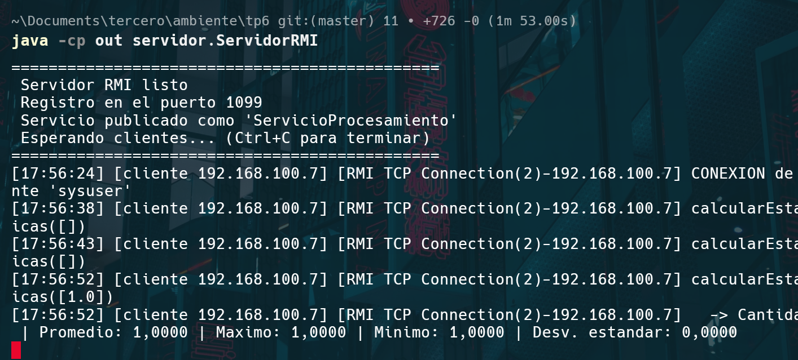
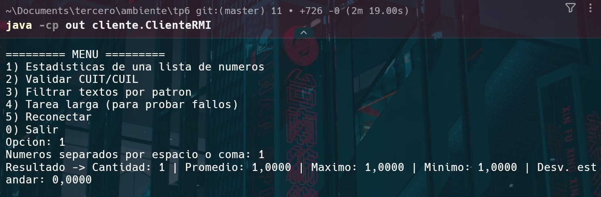
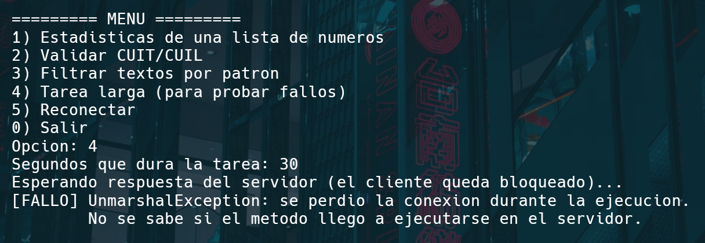

# TP6 – Middleware y Objetos Remotos (Java RMI)

**Materia:** Desarrollo de Aplicaciones para Ambientes Distribuidos
**Unidad 3:** Middleware y Objetos Remotos – RMI / RPC
**Tema:** Invocación Remota de Métodos y Abstracción de Comunicación

**Objetivo:** delegar tareas de cómputo a un servidor remoto usando **Java RMI**, sin escribir código de sockets ni de serialización a mano.

---

## Estructura del proyecto

```
tp6/
├── README.md
├── capturas/
└── src/
    ├── comun/                          # lo comparten cliente y servidor (el "contrato")
    │   ├── ServicioProcesamiento.java  # interfaz remota (extends Remote)
    │   ├── Estadisticas.java           # resultado serializable
    │   ├── ResultadoValidacion.java    # resultado serializable
    │   └── DatosInvalidosException.java# excepción de negocio
    ├── servidor/
    │   ├── LogicaNegocio.java          # cálculos puros, no sabe nada de RMI
    │   ├── ServicioProcesamientoImpl.java # objeto remoto + trazabilidad
    │   └── ServidorRMI.java            # crea el registro y publica el servicio
    └── cliente/
        └── ClienteRMI.java             # lookup + menú interactivo + manejo de fallos
```

---

## Ejercicio 1: Servidor de Procesamiento Remoto

### Interfaz remota

`ServicioProcesamiento` extiende `java.rmi.Remote` y **todos sus métodos declaran `RemoteException`**, porque cualquier llamada puede fallar por la red:

| Método | Qué hace |
|---|---|
| `calcularEstadisticas(double[])` | Devuelve cantidad, promedio, máximo, mínimo y desviación estándar (poblacional) |
| `validarCuit(String)` | Verifica un CUIT/CUIL: 11 dígitos, prefijo válido (20, 23, 24, 27, 30, 33, 34) y dígito verificador calculado con módulo 11 |
| `filtrarTextos(String[], String)` | Devuelve los textos que contienen el patrón (texto o expresión regular, sin distinguir mayúsculas) |
| `conectar(String)` | Saludo inicial, para que el servidor registre la conexión de un cliente |
| `tareaLarga(int)` | Extra: simula una tarea que tarda N segundos. Sirve para probar qué pasa si el servidor se cae en el medio |

Los resultados (`Estadisticas`, `ResultadoValidacion`) implementan `Serializable`, así que viajan **por valor**: se copian del servidor al cliente. El servicio en sí viaja **por referencia remota**, es decir, el cliente recibe un stub que apunta al objeto real del servidor.

### Servidor

- **Separación de responsabilidades:** `LogicaNegocio` tiene los cálculos y no conoce RMI. `ServicioProcesamientoImpl` es solo la capa remota: recibe la llamada, deja la traza y delega en la lógica.
- **Publicación:** `ServidorRMI` crea el registro con `LocateRegistry.createRegistry(1099)` y publica el servicio con `rebind("ServicioProcesamiento", servicio)`.
- **Trazabilidad:** cada operación se muestra en consola con la hora, la IP del cliente (`RemoteServer.getClientHost()`), el hilo que la atendió, los parámetros y el resultado.
- RMI atiende cada conexión en un hilo propio (`RMI TCP Connection(n)`), así que el servidor puede atender varios clientes a la vez.

### Cliente

- Obtiene la referencia con `LocateRegistry.getRegistry(host, puerto).lookup("ServicioProcesamiento")`.
- Tiene un menú interactivo. Las llamadas se escriben igual que si el objeto fuera local, por ejemplo `servicio.calcularEstadisticas(numeros)`: no hay sockets ni serialización a la vista.
- Todos los errores se manejan en un solo método, `invocar()`, que distingue entre:
  - **errores de negocio** (`DatosInvalidosException`): la llamada llegó bien, pero los datos no sirven;
  - **errores de comunicación** (`RemoteException` y sus subclases).

---

## Cómo compilar y ejecutar

Requisito: JDK 11 o superior. Desde Java 5 los stubs se generan solos (proxies dinámicos), así que no hace falta `rmic`.

```bash
cd tp6
javac -d out src/comun/*.java src/servidor/*.java src/cliente/*.java

# Terminal 1: servidor (crea el registro en el puerto 1099)
java -cp out servidor.ServidorRMI            # o: java -cp out servidor.ServidorRMI 1099

# Terminal 2 (y las que se quieran): cliente
java -cp out cliente.ClienteRMI              # o: java -cp out cliente.ClienteRMI <host> <puerto>
```

**Despliegue en dos máquinas distintas:**

1. Copiar `out/` (o al menos los paquetes `comun` y `cliente`) a la máquina cliente.
2. En el servidor, indicar la IP con la que lo ven los clientes. Si no se hace, el stub puede apuntar a `127.0.0.1`:
   ```bash
   java -Djava.rmi.server.hostname=192.168.1.10 -cp out servidor.ServidorRMI
   ```
3. En el cliente: `java -cp out cliente.ClienteRMI 192.168.1.10 1099`.
4. Habilitar en el firewall el puerto 1099 y los puertos que usa RMI para el objeto exportado.

### Datos de prueba

| Opción | Entrada | Resultado esperado |
|---|---|---|
| 1 | `4 8 15 16 23 42` | Promedio 18, máx 42, mín 4, desv. 12,3153 |
| 2 | `20-12345678-6` | VÁLIDO |
| 2 | `20-12345678-0` | INVÁLIDO (se esperaba 6) |
| 3 | `mesa;Mensaje urgente;casa;MENSAJERIA;auto` con patrón `mens` | `[Mensaje urgente, MENSAJERIA]` |
| 3 | patrón `[abc` | DATOS INVÁLIDOS (patrón mal formado) |
| 4 | `20`, y cortar el servidor con Ctrl+C mientras espera | `UnmarshalException` |

---

## Ejemplo de ejecución

**Servidor:**

```
==============================================
 Servidor RMI listo
 Registro en el puerto 1099
 Servicio publicado como 'ServicioProcesamiento'
 Esperando clientes... (Ctrl+C para terminar)
==============================================
[17:47:28] [cliente 127.0.0.1] [RMI TCP Connection(2)-127.0.0.1] CONEXION de cliente 'max'
[17:47:28] [cliente 127.0.0.1] [RMI TCP Connection(2)-127.0.0.1] calcularEstadisticas([4.0, 8.0, 15.0, 16.0, 23.0, 42.0])
[17:47:28] [cliente 127.0.0.1] [RMI TCP Connection(2)-127.0.0.1]   -> Cantidad: 6 | Promedio: 18.0000 | Maximo: 42.0000 | Minimo: 4.0000 | Desv. estandar: 12.3153
[17:47:28] [cliente 127.0.0.1] [RMI TCP Connection(2)-127.0.0.1] validarCuit("20-12345678-6")
[17:47:28] [cliente 127.0.0.1] [RMI TCP Connection(2)-127.0.0.1]   -> VALIDO - CUIT 20-12345678-6 correcto
[17:47:28] [cliente 127.0.0.1] [RMI TCP Connection(2)-127.0.0.1] filtrarTextos(5 textos, patron="mens")
[17:47:28] [cliente 127.0.0.1] [RMI TCP Connection(2)-127.0.0.1]   -> 2 coincidencias
[17:47:28] [cliente 127.0.0.1] [RMI TCP Connection(2)-127.0.0.1] tareaLarga(6 s) iniciada
```

**Cliente** (en la última llamada se cortó el servidor durante la tarea larga):

```
Resultado -> Cantidad: 6 | Promedio: 18.0000 | Maximo: 42.0000 | Minimo: 4.0000 | Desv. estandar: 12.3153
Resultado -> VALIDO - CUIT 20-12345678-6 correcto
Coincidencias (2): [Mensaje urgente, MENSAJERIA]
[DATOS INVALIDOS] Patron invalido: Unclosed character class
Esperando respuesta del servidor (el cliente queda bloqueado)...
[FALLO] UnmarshalException: se perdio la conexion durante la ejecucion.
        No se sabe si el metodo llego a ejecutarse en el servidor.
```

### Capturas







---

## Ejercicio 2: Cuestionario teórico

### 1. Abstracción del middleware: sockets puros vs. Java RMI

El **middleware** es una capa de software entre la aplicación y el sistema operativo/red que oculta la heterogeneidad y hace que los recursos remotos parezcan locales.

**Con sockets puros** (como en el TP3 y el TP4), para "llamar" a algo remoto tuve que hacer todo a mano:

- abrir y cerrar el `Socket`, y manejar el puerto;
- inventar un **protocolo**: qué operación se pide, con qué parámetros, y cómo se separa un mensaje del otro (en el TP4 usé un encabezado con tipo y largo);
- hacer el **marshalling/unmarshalling** de cada parámetro y del resultado (JSON o `DataOutputStream`), y respetar el orden de los campos;
- **despachar** del lado del servidor: leer el tipo y, según eso, llamar al método correcto;
- manejar los hilos para atender varios clientes y los errores de E/S.

**Con RMI** el cliente escribe `servicio.calcularEstadisticas(numeros)` y listo. El middleware se encarga de:

| Tarea | Quién la hace en RMI |
|---|---|
| Conexión y transporte | Protocolo JRMP sobre TCP, con reutilización de conexiones |
| Marshalling/unmarshalling de parámetros, resultados y excepciones | Serialización Java automática |
| Ubicar el servicio | Registro de nombres (`rmiregistry`, puerto 1099) con `rebind`/`lookup` |
| Elegir el método a ejecutar en el servidor | Skeleton/dispatcher (usa reflexión) |
| Concurrencia del servidor | Un hilo por conexión, lo gestiona RMI |
| Heterogeneidad (endianness, representación de datos) | Formato de serialización de la JVM, independiente del procesador |
| Referencias a objetos remotos | Stubs que se pasan como referencias remotas |

Así se logra **transparencia de acceso y de ubicación**: el código del cliente no cambia si el servidor está en la misma PC o en otra. Lo que **no** se puede ocultar del todo son los fallos de red. Por eso cada método declara `RemoteException` y obliga a tratarlos.

### 2. Ciclo de vida y Stub/Skeleton

**Stub (proxy, del lado del cliente):** es un objeto local que implementa **la misma interfaz** que el servicio remoto. Es lo que devuelve el `lookup()`. Cuando el cliente llama a un método:

1. empaqueta (marshalling) el identificador del método y los parámetros en bytes;
2. los envía por TCP al servidor;
3. **bloquea** el hilo del cliente hasta que llega la respuesta (modelo *call-return*);
4. desempaqueta (unmarshalling) el resultado o la excepción y se lo devuelve al cliente como si fuera una llamada local.

**Skeleton / Dispatcher (del lado del servidor):** recibe el mensaje y el *dispatcher* identifica qué objeto y qué método se pidió. El skeleton hace el **unmarshalling** de los parámetros, **invoca el método real** sobre el objeto (el *servant*, en mi caso `ServicioProcesamientoImpl`) y después hace el **marshalling** del resultado, o de la excepción, para mandarlo de vuelta.

Ciclo completo: **cliente → stub (marshal) → red → skeleton (unmarshal) → servant ejecuta → skeleton (marshal) → red → stub (unmarshal) → cliente**.

En Java moderno no se generan con `rmic`: el stub es un **proxy dinámico** que se crea al exportar el objeto (`UnicastRemoteObject`), y el rol de skeleton lo cumple el runtime de RMI usando reflexión.

### 3. Manejo de fallos parciales

En un sistema distribuido una parte puede fallar mientras la otra sigue funcionando. Si el servidor se interrumpe **durante** la ejecución de un método:

- El cliente está bloqueado en el stub esperando la respuesta. Al cortarse la conexión TCP, el stub no puede leer la respuesta y lanza **`java.rmi.UnmarshalException`** ("error unmarshaling return header", con una `EOFException` o `SocketException` adentro). Es lo que se ve en la prueba de la opción 4.
- El problema principal es que **el cliente no sabe si el método se ejecutó o no**: puede haberse cortado antes de empezar, a la mitad o justo después de terminar. RMI ofrece semántica de **"como máximo una vez" (at-most-once)**.
- Si el servidor **se cae colgado** (no cierra la conexión), el cliente puede quedar bloqueado indefinidamente si no hay un timeout configurado.

**Excepciones que se pueden presentar** (todas heredan de `RemoteException`):

| Excepción | Cuándo ocurre |
|---|---|
| `UnmarshalException` | Se cortó la conexión mientras se esperaba la respuesta |
| `ConnectException` | El servidor no está corriendo (conexión rechazada) al hacer una nueva llamada |
| `ConnectIOException` | Error de E/S al establecer la conexión |
| `NoSuchObjectException` | El servidor se reinició y el stub viejo apunta a un objeto que ya no existe |
| `NotBoundException` | No es `RemoteException`. Aparece en el `lookup` si el nombre no está publicado |
| `MarshalException` | Falló el envío de los parámetros |

**Cómo gestionarlas en producción:**

- **Capturar siempre `RemoteException`** y distinguirla de los errores de negocio (como `DatosInvalidosException`). No mostrarle al usuario un stack trace: darle un mensaje claro.
- **Timeouts**, para no quedar bloqueado para siempre. Por ejemplo, con las propiedades `sun.rmi.transport.tcp.responseTimeout` y `sun.rmi.transport.proxy.connectTimeout`.
- **Reintentos con backoff exponencial y jitter** (lo que vimos en el TP2), pero **solo para operaciones idempotentes**. Calcular estadísticas o validar un CUIT se puede repetir sin problemas. Una operación como "transferir dinero" no, porque si ya se había ejecutado se haría dos veces. En esos casos conviene usar un **id de petición** para que el servidor detecte duplicados.
- **Volver a hacer `lookup`** ante `NoSuchObjectException` o después de que el servidor se recupera (en el cliente está la opción 5 y la reconexión automática).
- **Circuit breaker**: si el servidor falla muchas veces seguidas, dejar de llamarlo por un tiempo.
- **Logs** en el servidor para poder rastrear qué operaciones se estaban ejecutando cuando ocurrió el fallo.

---

## Fuentes

- *Clase 6 – Middleware y Objetos Remotos: RPC, RMI, CORBA*, Lic. Gabriel Artaza.
- Oracle – [Java RMI: Getting Started](https://docs.oracle.com/javase/8/docs/technotes/guides/rmi/hello/hello-world.html).
- Oracle – Java SE 11 API: [`java.rmi`](https://docs.oracle.com/en/java/javase/11/docs/api/java.rmi/java/rmi/package-summary.html), [`RemoteException`](https://docs.oracle.com/en/java/javase/11/docs/api/java.rmi/java/rmi/RemoteException.html), [`UnicastRemoteObject`](https://docs.oracle.com/en/java/javase/11/docs/api/java.rmi/java/rmi/server/UnicastRemoteObject.html).
- Oracle – [Java RMI Specification](https://docs.oracle.com/en/java/javase/11/docs/specs/rmi/index.html).
- AFIP – Algoritmo de validación del dígito verificador de CUIT/CUIL (módulo 11).
